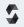
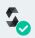
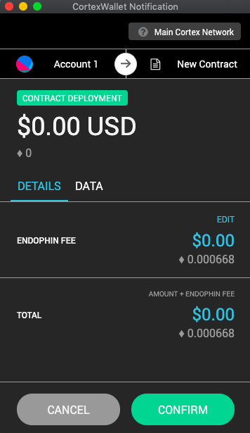
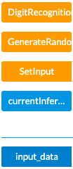
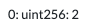

# Cortex AI Smart Contract Guide

Cortex is the first and currently the only public blockchain capable of executing on-chain AI. This tutorial will lead you through the process of deploying a simple “Hello World” AI Dapp. If you prefer to learn by reading the formal documentation, click here (https://github.com/CortexFoundation/tech-doc).

By the end of this tutorial, you will have learned how to write a simple handwritten digit recognition AI DApp that takes an input image from the user and tells which digit (0-9) is in the image by calling an on-chain AI model on Cortex.

Prerequsite:

- Chrome Browser
- Cortex Wallet Chrome Extension (Follow this guide to install it: https://github.com/CortexFoundation/Cortex_Release/tree/master/cortex-wallet if you have not done so)
- Some Cortex TestNet tokens (from faucet or from ERC20 exchanges)

First make sure from your Cortex wallet that you are on the TestNet. Click on the Cortex wallet extension, enter your password, and at the top of your wallet, you should see:


If you don't see this yet, click on the dropdown arrow and switch to the Dolores TestNet. (You may need to refresh and then repeat the steps above after this)

## Get Started

Here's the overall code we're going to write - always refer back to it if you get lost. We will go over it step-by-step next.

### Overall code

```javascript
pragma solidity ^0.4.18;

contract Infer {

    // initiate the variables
    uint256[] public input_data;
    // address of the on-chain model
    address modelAddr = 0x420bD8d2FE73514E9b77fdBc78c0306Fd8a12866;
    // the output will be stored in this variable
    uint256 public currentInferResult;

    constructor() public {
        // Here we define the dimension of the input_data. To feed an image input of dimension 1 * 1 * 28 * 28 into the model, we need 1 * 1 * 28 * 28 bytes.
        // Now, each uint256 in Solidity is 32 bytes. That's why we need divide 1 * 1 * 28 * 28 by 32 and round up.
        // To express this division in Solidity, we write (1 * 1 * 28 * 28 + 31) >> 5, where >> 5 means divide by 2^5 and adding the 31 allows us to effectively round up.
        input_data = new uint256[]((1 * 1 * 28 * 28 + 31) >> 5);
    }

    // you can choose to randomly generate input as opposed to taking the input image from the user
    function GenerateRandomInput() public {
        input_data[0] = uint(sha256(now));
        for(uint i = 1; i < input_data.length; ++i) {
          input_data[i] = uint(sha256(input_data[i - 1]));
        }
    }

    // set input_data in the contract as the user input, which we pass into the function as an argument
    function SetInput(uint256[] data) public {
        for(uint i = 1; i < input_data.length; ++i) {
          input_data[i] = data[i];
        }
    }

    // recognize digit using randomly generated input image
   function DigitRecognitionInfer() public {
        uint256[] memory output = new uint256[](uint256(1));
        inferArray(modelAddr, input_data, output);
        currentInferResult = (output[0] >> (256 - 32)) & ((1 << 32) - 1);
        currentInferResult = currentInferResult % 10;
    }
}


```

### Code Walkthrough

Now, let's open Remix (link: cerebro.cortexlabs.ai/remix/), the official Cortex IDE, where you can write and later deploy this contract. (You could also write the code in another IDE if you prefer and paste the code into Remix later).

We will now walk through the code step-by-step. Pay close attention to the comments.

### Create a contract

```javascript
pragma solidity ^0.4.18;

contract Infer {

}
```

### Initiate basic variables

```javascript
    // The image input is in the form of a matrix (a uint256 array) of pixels, which has dimension 1 * 3 * 32 * 32. If you're confused why this is the dimension of the input image, see footnotes.
    uint256[] public input_data;
    // The address of an exisitng on-chain AI model you will call to recognize the digit in the image. If you prefer to use your own digit recognition model, you can upload it to Cortex storage layer first and then substitute this address.
    address modelAddr = 0x420bD8d2FE73514E9b77fdBc78c0306Fd8a12866;
    // This variable will store the output of the AI inference.
    uint256 public currentInferResult;
```

### Write the function to take user input

```javascript
 // If we want to input custom user image, we input it as the "data" argument in this function
    function SetInput(uint256[] data) public {
        for(uint i = 1; i < input_data.length; ++i) {
          input_data[i] = data[i];
        }
    }
```

### Write the main function to call the AI model

Pay attention. This is the most important function in this contract. It takes an input image array of dimension 1 x 3 x 32 x 32 and return a number from 0-9 as the output, telling you which digit is in the image.

```javascript
    // recognize digit using user input image
    function DigitRecognitionInfer() public {

        // initialize variable
        uint256[] memory output = new uint256[](1);
        // inferArray is a built-in function in CVM, it takes the input "input_data" (which we have set from either the SetInput or GenerateRandomInput function), feed it to this model at "modelAddr" and store the inference result in "output", which you just initialized above and pass in as a placeholder here
        inferArray(modelAddr, input_data, output);

        // These two lines below will convert the output into a digit between 0-9 and store it in "currentInferResult". (The conversion has to do with big endian vs. little endian under the hood)
        currentInferResult = (output[0] >> (256 - 32)) & ((1 << 32) - 1);
        currentInferResult = currentInferResult % 10;
    }
```

Note: Notice we did not go over the _GenerateRandomInput()_ and _DigitRecognitionInfer()_ funcitons, because they are not essential. All you need to know is that _GenerateRandomInput()_ will randomly generate an input image and store it in the variable _input_data_ and _DigitRecognitionInfer()_ will call the AI model to recognize which digit is in that randomly generated input image. Not too useful, since most of the time we will be taking custom user input as opposed to randomly generated image, but you can use them to test whether your contract is working properly.

## Compile the Contract

To compile this contract from Remix (link again: cerebro.cortexlabs.ai/remix/), first click on  on the left side of the page.

Then activate the two modules: "Deploy And Run Transactions" and "Solidity Compiler".

We first need to compile this contract. So click  on the left. Then click "compile" to compile your contract. Once you have compiled successfully, the icon on the left should look like this: 

## Deploy the Contracts

Now let's deploy this contract to the TestNet.

Click on the Cortex logo  on the left to go to the Deploy tab.

Now if a window does not pop up, click on your Cortex wallet on the top right corner to see the transaction window. You may leave everything as default and click on "confirm". (You should see your account filled in automatically; if not, you may need to log into your wallet first and reload) A wallet window should pop up asking you to confirm the transaction like the one below. Review the details and then click "confirm" again.



After a few minutes, your contract should have been successfully deployed and show up under the "Deployed Contracts" section!

Click on the dropdown menus and you will see all the functions that you can call. Click on the clipboard and you will see the address of your contract. Make sure you save this address somewhere so that you know where your contract was deployed.

At this stage, you're pretty much done: you can click GenerateRandomInput to generate a random input (remember to always go to your Cortex wallet to confirm function calls) and then click DigitRecognitionInfer to determine what digit the randomly generated input is. If you click on currentInferResult, you will see something like "0: uint256: number", where number is your infer result.

We have now finished walking through the entire workflow of developing on Cortex.

However, running the program on randomly generated input images is boring. So for the sake of completeness (and fun), we will go on to show how to take user input, which involves writing a Python script!

---

## Taking User Input

Use this Python script to convert your custom image into an array of supported size.

Open Terminal, first run

```Python
pip3 install Pillow
```

Start a Python file, and let's name it "convert.py", which will take your custom image as an input and output an array of pixel values with dimensions compatible with our contract above! Make sure you put your custom image in the same directory as this script.

```Python
import sys
from PIL import Image

img = Image.open(sys.argv[1])
img = img.resize((28,28))
img = img.load()

h = '0123456789abcdef'
s = ''
for i in range(28):
    for j in range(28):
        t = 0
        if type(img[j, i]) is int:
            t = img[j, i] // 2
        else:
            for k in img[j, i]:
                t += k
            t //= len(img[j, i]) * 2
        s += h[t // 16] + h[t % 16]
ret = []
for i in range(0, len(s), 64):
    if i <= len(s):
        e = i+64
        if e > len(s):
            e = len(s)
        subs = s[i:e]
        if len(subs) < 64:
            subs = subs + '0' * (64 - len(subs))
        ret.append('0x' + subs)
    else:
        ret.append('0x' + '0' * (len(s) - i + 64) + s[i:])

print('[' + ','.join(['"' + x + '"' for x in ret]) + ']')
```

Caveat: this python script above only works for MNIST test set - if you want to get the pixel value of your custom images, you may need to modify it accordingly.

At runtime, run

```Python
python3 convert.py your_img_name.jpg
```

Replace your_img_name with your actual image name!

If everything goes well, Terminal should output an array of pixel values which you can copy. For an image like this （if you need more test images, here's a wonderful image dataset on Kaggle https://www.kaggle.com/scolianni/mnistasjpg):


The Python program should return an array like this:

["0x0000000000000000000001000002010005000007000009000000000000000000","0x0000000000060000030000050001010800010100000000000000000000000000","0x030400040000040000090000000a000200000000000000000000000000000000","0x000000000000000500000501000000000000000000000000060007050d110826","0x5a5911020000000000000000000000000000000000004b7f7d7d797e7e7f1603","0x000200040000000000000000000000000324667f77797f7f7d7c64631c000900","0x000000000000000000000000006d7f787f7c7d7d7d7f7f797018000600000000","0x00000001010101000020727f7f7a3b1114377d7f7c3e0a000000000000000000","0x0000000006001f33383a11000000647a7f7f0006000000000100000000000001","0x00000102000500030300257a7f7f020000000000000000000101020200070000","0x000400010000117f7f7e05050000000000000001010100000101000605000000","0x0306317f7f7c0706000000000000000000000000000000000203050000085c7b","0x7f79060000000000010100000000010202000500192f2a02020c7b7b7f680004","0x00000000020000000003070931335b5e767e7e5f5f71797e6909030000000000","0x0002000010365c7b7f797f7a7f7f797d7f787f7f6d3e04000000000001000000","0x3f7f757f7f7b726a797d7f7f7c7f7e7c7f79550600000000000500047e7f7f74","0x652a001a62777f71774736607f787f5a0000000003000b007a797f7f6c75716a","0x7a7d7f772600000a5b7b77790000000000000002527d7f7a7f797e7d7f62351d","0x00090103001b7f4f00000000000c000003115361585b52160105030300000200","0x0000070100000000050007000600020000000300030000000400050002000005","0x000000000007000200000c000004000004000500000000010000030000000000","0x0000000000000000000000000000000000000000000000000000000000000000","0x0000000000000000000000000000000000000000000000000000000000000000","0x0000000000000000000000000000000000000000000000000000000000000000","0x0000000000000000000000000000000000000000000000000000000000000000"]

## Running the Contract on Custom Image

Now let's go back to Remix to infer the contract.

From , type in your contract address and then click the button to load your contract. (If it doesn't load, try compile your contract again)

Now click on the dropdown arrow and you can see the list of callable functions in the contract like this:



Paste your custom image input (that monstrous array above) into SetInput and then click the button, confirm the transaction in the popup window.

Finally, click on DigitRecognitionInfer, confirm the transaction. Your final inference result should be stored in currentInferResult in a few seconds!

Expect to see something like this:

(Don't worry about the 0 in front; your final result is stored is behind the "uint256"). As you can see the model has successfully determined that the image is a 2.

Congratulations! You are now one of the first people on earth to have successfully written, compiled, deployed and executed an AI DApp. If you have any questions, feel free to reach out to the Cortex team. Join our Telegram group at https://t.me/CortexOfficialENOF

---

### FAQs

**Question 1:** Why is the image 1 x 3 x 32 x 32 ?

**Answer 1:**

1: 1 image

3: 3 colors in RBG - red, blue, green (each can take on a value from 0 to 255). Varying combinations of RBG can get you different colors. In total, there's 256 x 256 x 256 color combinations.

32: 32 rows of pixels

32: 32 columns of pixels

Visualize one such array as

[

red [ [ row1 ],[ row2 ],[ row3 ],[ row4 ]... [ row32 ] ]

blue [ [ row1 ],[ row2 ],[ row3 ],[ row4 ]... [ row32 ] ]

green [ [ row1 ],[ row2 ],[ row3 ],[ row4 ]... [ row32 ] ]

]

where [ row1 ] looks like [ [col1],[col2],[col3],[col4]...[col32]] and within each of [col1] lives a value from 0-255, indicating how much red/green/blue it has in that pixel.

**Question 2:** How do I deploy my contract to MainNet?

**Answer 2:** Simply switch to MainNet in your Cortex wallet and repeat all steps from above!
