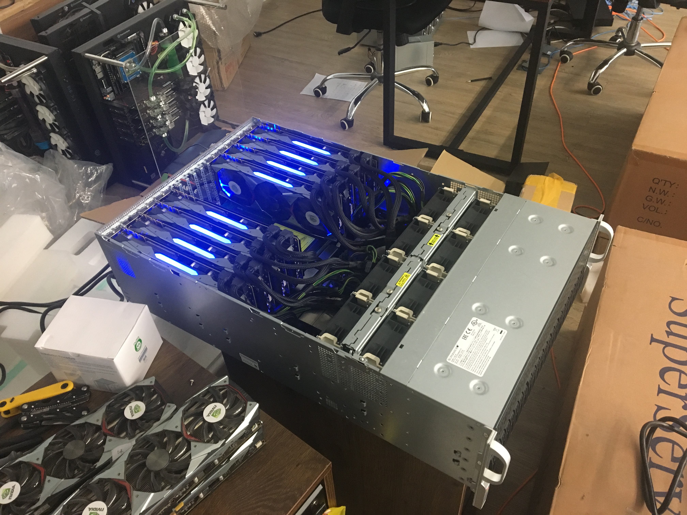

# Cortex_Silencer
This is a demonstration to show Cortex project structure. It is a small but working prototype to show:

How to generate blocks;

How to call AI computational heavy functions  within smart contracts;

How the CVM was abstracted placed in the framework;

How the DAIApps would be developed.

The repository will be continuously updated along with the formal version of the development.

## Environment

### Hardware
* CPU: E5-2683 v3
* GPU: 8x1080Ti
* RAM: 64 GB
* Disk: SSD 60 EVO 250 GB

### Software
* MXNet
* OpenCV 3.1

### Others
* Dataset: ImageNet Dataset (winter 2011 release) [http://image-net.org/imagenet_data/urls/imagenet_winter11_urls.tgz]
* Models [http://mxnet.incubator.apache.org/model_zoo/index.html]:  
  * CaffeNet
  * Network in Network
  * SqueezeNet
  * VGG16
  * VGG19
  * Inception v3 / BatchNorm
  * ResNet-152
  * ResNet101-64x4d

## How to run
* python Node.py

## Testing machine
